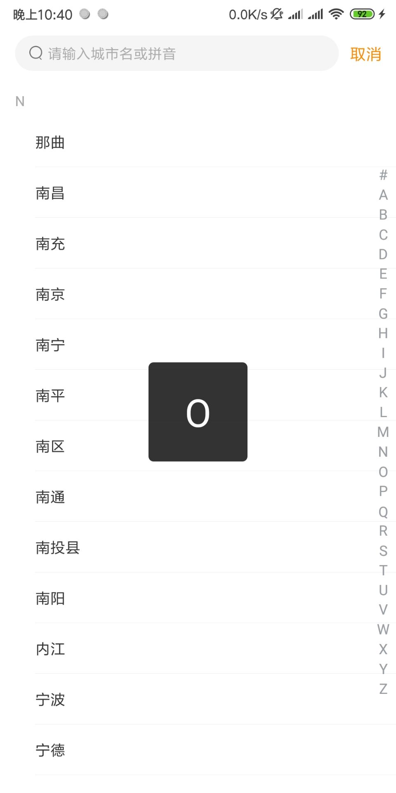
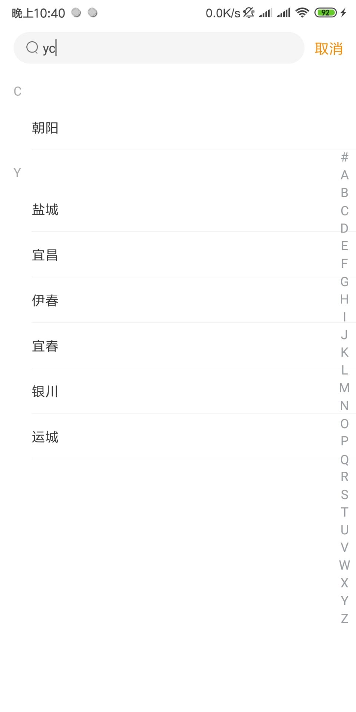
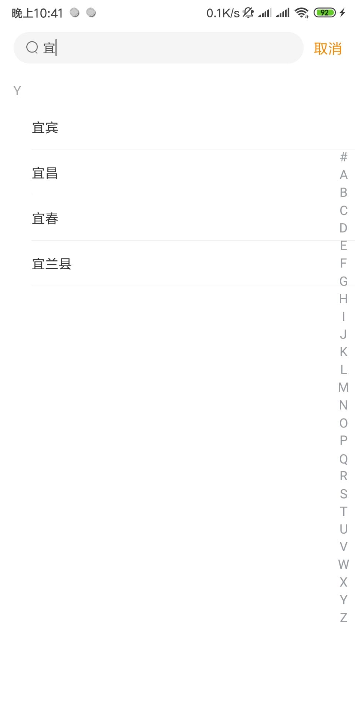

# **CitySelect**     

## 选择城市控件

[](https://jitpack.io/#MZCretin/CitySelect)

### 系列

在工作之余，打算将一些常用的逻辑页面，模块，功能点做成library库，这样当有相似需求的时候，可以做到插拔式开发！现在系列中有以下内容

+ [App内部自动更新-AutoUpdateProject](https://github.com/MZCretin/AutoUpdateProject)
+ [选择城市-CitySelect](https://github.com/MZCretin/CitySelect)

### 优势

+ **包含当前定位城市，热门城市已经城市列表的展示**
+ **点击重新定位可回传给调用者做定位处理**
+ **城市列表按照首字母A~Z排序，字母索引悬浮**
+ **右侧含有快速索引工具条，点击所以快速进行列表定位**
+ **包含城市搜索功能，包含汉字搜索，拼音搜索以及拼音首字母搜索（这个是别的不支持的）**
+ **使用简单，设置数据已经各种回调监听即可**

### demo下载

[Demo下载](https://raw.githubusercontent.com/MZCretin/CitySelect/master/pic/demo.apk)

### 效果预览

<div style="background:#e3e3e3; color:#FFF" align=center > </div>

### 使用方式

+ Step1 Add it in your root build.gradle at the end of repositories.

  ```java
  allprojects {
  		repositories {
  			...
  			maven { url 'https://jitpack.io' }
  		}
  	}
  ```

+ Step2 Add the dependency.

  ```java
  dependencies {
  		implementation 'com.github.MZCretin:CitySelect:latest_version'
  }
  ```

+ Step3 import the view wherever you need.

  ```xml
  <com.cretin.tools.cityselect.view.CitySelectView
          android:id="@+id/city_view"
          android:layout_width="match_parent"
          android:layout_height="match_parent"
          app:layout_constraintBottom_toBottomOf="parent"
          app:layout_constraintLeft_toLeftOf="parent"
          app:layout_constraintRight_toRightOf="parent"
          app:layout_constraintTop_toTopOf="parent" />
  ```

+ Step4 init data and add listeners you need.

  ```java
      //设置所有城市数据
  	final List<CityModel> allCitys = new ArrayList<>();
  	allCitys.add(new CityModel("深圳","10000000");
  	allCitys.add(new CityModel("深圳","10000000");
  	allCitys.add(new CityModel("深圳","10000000");
  	allCitys.add(new CityModel("深圳","10000000");
      ...
                  
      //设置热门城市列表 这都是瞎写的 哈哈哈
      final List<CityModel> hotCitys = new ArrayList<>();
      hotCitys.add(new CityModel("深圳", "10000000"));
      hotCitys.add(new CityModel("广州", "10000001"));
      hotCitys.add(new CityModel("北京", "10000002"));
      hotCitys.add(new CityModel("天津", "10000003"));
      hotCitys.add(new CityModel("武汉", "10000004"));
  	...
                               
      //设置当前城市数据
      final CityModel currentCity = new CityModel("深圳", "10000000");
  
      //绑定数据到视图 需要 所有城市列表 热门城市列表 和 当前城市列表 
      //allCitys是城市列表 必传 hotCitys是热门城市 不传就不显示 currentCity 当前定位城市 不传就不显示
      citySelectView.bindData(allCitys, hotCitys, currentCity);
                              
      //设置城市选择之后的事件监听
      citySelectView.setOnCitySelectListener(new OnCitySelectListener() {
         @Override
         public void onCitySelect(CityModel cityModel) {
                Toast.makeText(SelectCityActivity.this, "你点击了：" + cityModel.getCityName() + ":" + cityModel.getExtra().toString(), Toast.LENGTH_SHORT).show();
              }
  
         @Override
         public void onSelectCancel() {
                Toast.makeText(SelectCityActivity.this, "你取消了城市选择", Toast.LENGTH_SHORT).show();
              }
          });
  
      //设置点击重新定位之后的事件监听
      citySelectView.setOnLocationListener(new OnLocationListener() {
          @Override
          public void onLocation() {
              //这里模拟定位 两秒后给个随便的定位数据
              citySelectView.postDelayed(new Runnable() {
                      @Override
                      public void run() {
                          citySelectView.reBindCurrentCity(new CityModel("广州", "10000001"));
                      }
                  }, 2000);
              }
          });
  
  ```

  